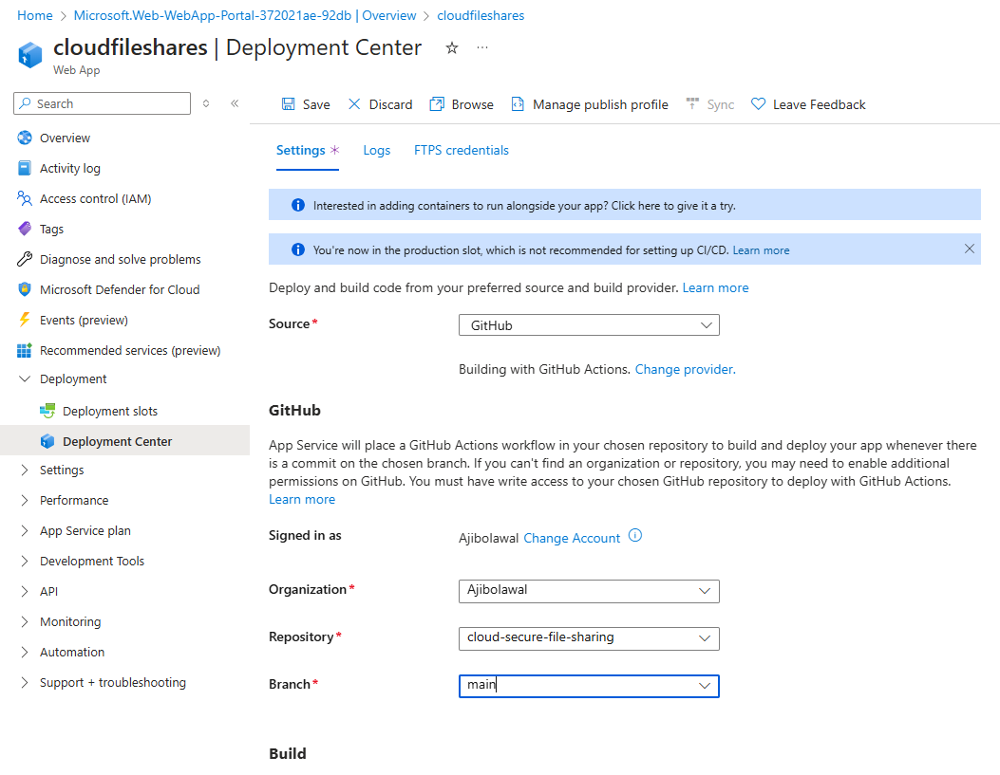
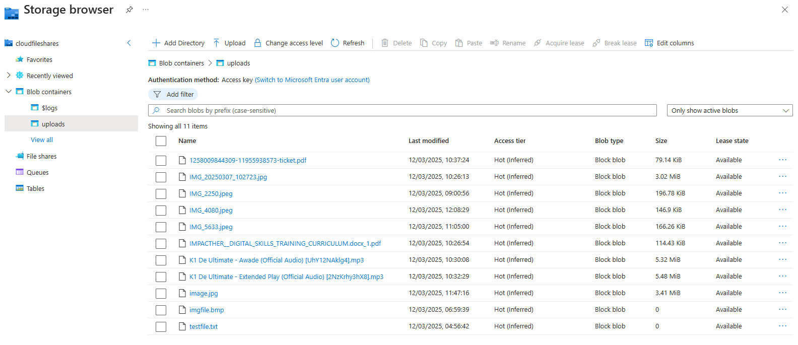

# ☁️ Secure Cloud File Sharing ☁️

This project is all about providing a secure way to share files using cloud technology. It's built with Node.js and Azure, and it lets you upload, download, and share files using links that only work for a limited time. We use Azure Blob Storage to keep your files safe, and we've set up a system to automatically delete files after 24 hours to help with security and keep things tidy. This project demonstrates a secure cloud-based file-sharing application with a focus on secure file handling and access control.

## 🚀 Key Features

- Secure File Uploading: Makes it easy and safe for users to upload their files.
- Time-Sensitive Download Links (Security Feature): Generates ephemeral download links that expire after 24 hours. This is a security feature designed to limit exposure and control access to shared files.
- Azure Blob Storage for Scalable and Secure Storage: Uses Azure Blob Storage to provide a reliable and scalable place to store your files in the cloud.
- Automatic File Tidying (Automated Security Measure): We've set up Azure Storage to automatically delete files after 24 hours. This is an automated security measure to reduce the risk of data breaches from old files and helps to manage storage effectively.
- Running on Azure Web Apps: The application is hosted on Azure Web Apps, so it's accessible and can handle plenty of users.
- Automated Deployment with GitHub Actions: We use GitHub Actions to automatically deploy the application, making sure it's done smoothly and reliably.
- Using Environment Variables: The application uses environment variables for its settings, which is a good way to keep sensitive information out of the code itself.

## 🛠️ Deployment and Configuration

### 1. Create a Storage Account in Azure
- In the Azure portal, create a new storage account.
        
- Once deployed, navigate to the storage account.
        

### 2. Create a Container
- Navigate to "Data storage" → "Containers".
- Create a new container named "uploads".

    

### 3. Obtain Access Keys
- Retrieve the access keys for your storage account.
        

### 4. Local Development Setup
- Clone the repository to your local machine.
- Create a `.env` file in the project's root directory.
 - Add the storage account access key information to the `.env` file as environment variables.
        

### 5. Running the Application Locally
- Open your terminal and navigate to the project directory and run: `node app.js`.

    

- If you encounter an error, you may need to install dependencies. For example, if you get an error related to Express, run: `npm install express`

    

- Continue running `node app.js` until you see a message indicating the server is running on a specific port - similar to the first screenshot.

### 6. Testing Locally
- Open the application in your web browser and use the file upload functionality:
    - Choose a file → Select "Open" → Click "Upload".
            
    - Upon successful upload, you will see a "File uploaded successfully!" message.
        

 - You will also be provided with:
    - An option to download the file.
    - An option to copy the download link.

### 7. Verifying Uploads in Azure
- In the Azure portal, navigate to your storage account.
- Go to "Storage browser" → "Blob containers" → "uploads".
- You should see the uploaded file.
        

### 8. Configure Lifecycle Management
- In the Azure portal, navigate to "Data management" -> "Lifecycle management" in your storage account.
    - Create a name for the rule, such as 'Delete files after 1 day', and select 'Limit blobs with filters' as the rule scope.
        
    - Add the condition: if the base blobs were created more than a day ago, then the blob will be deleted.
        
    - Add a filter set with the blob prefix as `uploads/` to ensure that only items within this specific container are deleted.
        
    - Ensure the rule is enabled.
        

### 9. Deploying to Azure Web Apps
- In the Azure portal, navigate to "App Services" → "Create +" → "Web App".
    - Select your resource group.
    - Provide a name for your web app.
    - Choose the runtime stack (e.g., Node 20 LTS).
    - Select the appropriate region and pricing plan.
    - Click "Review + create" and then "Create".
    
    

### 10. Deployment Centre Configuration
- Once the web app is deployed, go to the "Deployment Center".
    - Select "GitHub" as the source.
    - Enter the relevant details for your GitHub repository and then Click "Save".
        

### 11. GitHub Actions Deployment
- Go to your GitHub repository and navigate to the "Actions" tab.
    - You will see the deployment workflow in progress.
        

    - Once the deployment is complete, you should see a success message.
        

### 12. Accessing the Web App
- In the Azure portal, navigate to your web app.
- Obtain the default domain URL.
        

### 13. Updating HTML Code
- Update your HTML code to point to the web app's domain instead of your local development server.
    - Local

        

    - Web App Domain

        
- Commit and push these changes to your GitHub repository.
- The deployment will trigger again.
        

### 14. Verifying Deployment
- You can verify the deployment status in the "Deployment Center" of your web app in the Azure portal.
        

### 15. Setting Environment Variables in Azure
- In your web app's settings, go to "Environment variables" -> "Add".
        

- Add the environment variables that you previously configured in your local `.env` file.
- Click "Apply" and then "Confirm" to save the changes.
        

### 16. Secure Environment Variable Handling (Security Hardening Recommendation)
- To enhance security hardening, it's strongly recommended to manage sensitive information, such as API keys and connection strings, securely. While not used in this project, Azure Key Vault is a best practice for this purpose.

- Key Vault offers significant advantages:
    - **Centralised Secret Management:** Consolidates application secrets into a single, managed, and secure repository.
    - **Fine-Grained Access Control:** Enables precise control over who or what can access stored secrets, adhering to the principle of least privilege.
    - **Comprehensive Audit Logging:** Provides detailed logs of secret access, facilitating security monitoring and compliance. 
    - **Mitigation of Accidental Exposure:** Significantly reduces the risk of inadvertently exposing sensitive information in code, configuration files, or logging systems.
- While not implemented here, Azure Key Vault is a critical security best practice for protecting sensitive credentials in a production cloud environment.

### 17. Verification
- Azure is now successfully hosting the web app.
- Files can be uploaded successfully.
        

- The website has been sent out to people for testing, and these are the results in the storage: Verify that uploaded files appear in your storage account: "Storage Account Overview" → "Storage browser" → "Blob containers" → "uploads".
        
    

## 🛠️ Tools Used
- Node.js
- Azure Blob Storage
- Azure Web Apps
- GitHub Actions

## 🧠 Skills Gained
- Cloud Service Deployment and Management (Microsoft Azure)
- Cloud Storage Management and Security (Azure Blob Storage)
- CI/CD Pipeline Implementation and Automation (GitHub Actions)
- Environment Configuration and Security Best Practices
- Cloud Security Fundamentals (including access control, data protection, and threat mitigation)
- Access Control and Authorisation Principles
- Security Hardening Techniques
- Automation

## 🔮 Future Enhancements
- **Enhanced User Authentication and Authorization (Security Focus):** Implement robust user authentication and authorisation mechanisms, such as multi-factor authentication (MFA) and role-based access control (RBAC). This would significantly enhance the security posture of the application by providing granular control over user access and protecting against unauthorized access.
- **Scalable File Handling and Management (Cloud Engineering Focus):** Enable support for uploading and managing larger files and optimize file storage for improved performance and scalability. This could involve implementing features like chunked uploads, background processing for file handling, and efficient storage strategies to ensure the application can handle increased data volumes and user traffic.
- **Improved User Interface and Experience with Accessibility Considerations (Cloud Engineering Focus):** Develop an improved user interface (UI) and user experience (UX) for enhanced usability and accessibility. This includes ensuring the application is user-friendly, intuitive, and accessible to users with disabilities, demonstrating a commitment to inclusivity and modern web development practices.
- **Integration with Additional Azure Services for Extended Functionality (Cloud Engineering Focus):** Integrate with additional Azure services to extend functionality and leverage the power of the Azure ecosystem. This could include services such as Azure Functions for serverless computing, Azure Database for persistent data storage, and Azure Monitor for enhanced logging and monitoring.
- **Advanced Security Monitoring, Logging, and Threat Detection (Cloud Security Focus):** Implement comprehensive error handling, logging, and monitoring capabilities, including advanced security monitoring and threat detection. This could involve integrating with Azure Security Center or other security information and event management (SIEM) systems to provide real-time security insights, detect anomalies, and proactively respond to potential threats.
- **Advanced Data Protection and Security Features (Cloud Security Focus):** Explore and implement advanced data protection and security features, such as encryption at rest and in transit, data loss prevention (DLP) measures, and vulnerability scanning to further strengthen the security of the application and protect sensitive data.